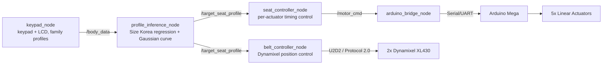

# Smart Seat (Family Care) 🚗💺

> A ROS 2-based adaptive car seat system that automatically reshapes the backrest curve and adjusts seatbelt height to fit each occupant — from pregnant passengers to children old enough to have outgrown a car seat, to guests — sharing a single family vehicle.

**Embedded SW Contest 2026 — 자유공모 (Free Topic)** | Team **CAR멜레온**, Dongguk University, Dept. of Mechanical, Robot & Energy Engineering

**Team**
| Name | Role |
|---|---|
| **Sulbeen Min** (민설빈, Team Leader) | ROS 2 system integration, control logic, hardware bridge, calibration |
| **Jaekyung Kim** (김재경) | *(add role)* |
| **Bogyeom Cha** (차보겸) | *(add role)* |

---

## 📌 Overview

Smart Seat infers a rider's body profile — from height, weight, and pregnancy status — using an anthropometric regression model built on **Size Korea 8th survey data (n=5,092)**, then drives:

- **5 linear actuators** to reshape the backrest along a Gaussian curve centered on the lumbar apex (with a softened, lower curve for pregnant riders, based on ergonomics literature on lordosis and iliac artery compression risk), and
- **2 Dynamixel servo motors** to raise or lower the seatbelt anchor to shoulder height (or pelvic height in pregnant mode).

Riders select a saved family profile (A/B/C) or enter a custom height as a guest, via a 4×4 keypad + I2C LCD. The whole pipeline — input → body model → actuator targets → motor motion — runs as a set of ROS 2 nodes on a Raspberry Pi, bridging to an Arduino Mega (linear actuators) and a U2D2 Power Hub Board (Dynamixel belt motors).

<!-- TODO: 실물 사진 또는 구동 GIF 추가 -->
<!--  -->

| | |
|---|---|
| **Platform** | Raspberry Pi 3 (ROS 2 Humble) + Arduino Mega |
| **Actuation** | 5x Linear Actuators (backrest) + 2x Dynamixel XL430-W250-T (seatbelt height) |
| **Input** | 4x4 matrix keypad + I2C LCD (family profiles + guest mode) |
| **Language** | Python (ROS 2 nodes), C/C++ (Arduino firmware) |
| **Communication** | ROS 2 topics · Serial/UART (Arduino) · U2D2 (Dynamixel Protocol 2.0) |

---

## 🏗️ System Architecture



---

## 🧩 ROS 2 Nodes

### `profile_inference_node`
Converts height (+ weight, + pregnancy flag) into:
- a per-actuator backrest push profile, using a **Gaussian curve** centered on the lumbar apex (`sitting_height × 0.18`, or `× 0.12` and softened in pregnant mode) — modeling the cloth+foam surface as a continuous curve rather than 5 independent points, and
- a target seatbelt height (shoulder height `sitting_height × 0.80` in normal mode, a fixed pelvic target in pregnant mode), converted to Dynamixel ticks via an empirically calibrated ticks/mm ratio.

Sitting height is estimated from a linear regression fit to Size Korea 8th survey data (R² = 0.842).

### `seat_controller_node`
Drives the 5 linear actuators (no position encoders):
- Per-motor, per-direction speed constants (measured individually) convert a target displacement into a drive duration
- Threaded, simultaneous multi-actuator motion
- Reset sequence to re-home all actuators to a known baseline

### `belt_controller_node`
Drives the 2 Dynamixel seatbelt motors in **Extended Position Control Mode** (multi-turn):
- Loads a calibrated home position from `belt_home.json` and homes once at startup
- Converts target ticks (from `profile_inference_node`) into absolute Dynamixel goal positions
- Waits for actual arrival (position-stall detection) rather than a fixed timeout
- Ignores the shared reset signal — only the linear actuators reset on demand, since belt homing is comparatively slow

### `arduino_bridge_node`
Bridges ROS 2 and the embedded layer — subscribes to `/motor_cmd`, translates commands into the `M,<motor>,<dir>,<speed>` serial protocol, and forwards them to the Arduino Mega over UART.

### `keypad_node`
Scans a 4×4 matrix keypad (non-blocking), drives a 16x2 I2C LCD, and loads family profiles (name, height, pregnancy flag) from `profiles.json`. Profile buttons (A/B/C) publish a saved profile; a guest button enters free-form height entry with range validation.

---

## 🔧 Hardware

| Component | Role |
|---|---|
| Raspberry Pi 3 | Runs ROS 2 Humble, all high-level nodes |
| Arduino Mega | Low-level PWM driving for 5 linear actuators |
| 5x Linear Actuators + L298N drivers | Backrest shape adjustment |
| 2x Dynamixel XL430-W250-T + U2D2 Power Hub Board | Seatbelt anchor height adjustment |
| 4x4 matrix keypad + I2C LCD (0x27) | Family profile selection / guest input |

USB device names are pinned via `udev` rules (`/dev/arduino_linear`, `/dev/belt_u2d2`) so port numbers no longer shift between reboots or reconnects.

<!-- TODO: 배선도 / 회로 사진, Fusion360 조립도 추가 (docs/cad/ 폴더 참고) -->

---

## 🚀 How to Run

```bash
# 1. Build the workspace
cd ~/ros2_ws
colcon build --packages-select smart_seat
source install/setup.bash

# 2. Launch the full system
ros2 launch smart_seat smart_seat.launch.py

# 3. (Example) Send a body profile directly, bypassing the keypad
ros2 topic pub /body_data geometry_msgs/msg/Point "{x: 178.0, y: 65.0, z: 0.0}" --once
# x = height (cm), y = weight (kg), z = 1.0 for pregnant mode
```

---

## 🐛 Troubleshooting Log

Real problems hit and solved during development:

**Repeated stepper driver failures (NEMA17 + DRV8825)**
Symptom: driver board smoke, melted jumper wires on GND and VMOT lines, twice. Root cause never fully confirmed (suspected VREF/current-limit misconfiguration). Fix: abandoned the stepper approach entirely and switched to Dynamixel XL430 servos with a U2D2 Power Hub Board, which have built-in current limiting.

**Raspberry Pi undervoltage after switching power adapters**
Symptom: intermittent USB dropouts, `Undervoltage detected!` in `dmesg`. Diagnosis: the new USB-C adapter was PD-only (9V fixed output) and incompatible with the Pi's fixed-5V requirement. Fix: switched to a basic 5V power bank.

**Belt tick-to-mm ratio looked wildly nonlinear**
Symptom: identical tick commands produced very different real-world displacements across trials; initially suspected reel slip or layer-diameter growth from overlapping string winds. Root cause: the test script only observed motion for a fixed 4–6 second window and force-cut torque before large moves had actually finished — an artifact of the test harness, not the mechanism. Fix: rewrote the test/move scripts to wait for actual arrival (position-stall detection) instead of a fixed timeout.

**USB port numbers (`/dev/ttyUSB0/1/2`) kept shifting**
Symptom: recurring `could not open port` errors across both the Arduino and the Dynamixel U2D2 whenever a device was reconnected or the Pi rebooted. Fix: added `udev` rules keyed on each device's USB vendor/product ID and serial number, giving them fixed symlink names (`/dev/arduino_linear`, `/dev/belt_u2d2`).

**Physical motor position swap (linear actuators)**
Symptom: actuator at the 150mm (lumbar) mounting position was actually wired to Arduino motor channel 2, and vice versa for channel 1 — a wiring/assembly mix-up discovered after calibration. Fix: rather than re-wiring, added a `MOTOR_MAP` lookup in `seat_controller_node` so logical actuator positions map to the correct physical channel in software.

**Belt position drifted after repeated manual repositioning**
Symptom: after physically moving the belt motors by hand during debugging, the seat would move to unexpected/out-of-range positions on the next command. Root cause: the saved `belt_home.json` reference no longer matched the true physical home. Fix: re-homed by hand, re-captured the current raw encoder position into `belt_home.json`.

**Race condition on repeated button presses**
Symptom: pressing the same profile button (e.g., B) repeatedly sent the belt to a different position each time. Root cause: each press spawned a new thread that concurrently wrote to the same Dynamixel `GroupSyncWrite` object. Fix: added a `threading.Lock` around each belt move so commands execute strictly in sequence.

<!-- 개발하면서 겪는 문제들을 여기에 계속 기록하세요. -->

---


