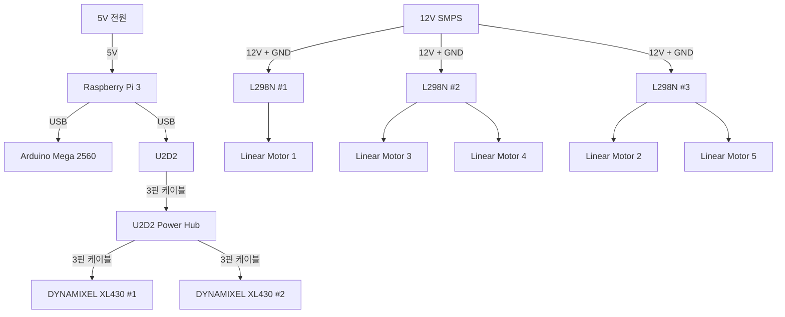

# 스마트 시트 시스템 전원 계통도

## 1. 전체 전원 구조



---

## 2. Raspberry Pi 3 전원

Raspberry Pi 3는 별도의 5V 전원으로 직접 전원을 공급받는다.

```text
5V 전원
   │
   ▼
Raspberry Pi 3
```

본 시스템에서는 12V → 5V 컨버터를 사용하지 않는다.

---

## 3. Arduino Mega 2560 전원

Arduino Mega 2560은 Raspberry Pi 3와 USB 케이블로 연결한다.

USB 연결은 Serial 통신과 Arduino 전원 공급에 사용한다.

```text
5V 전원
   │
   ▼
Raspberry Pi 3
   │
   │ USB
   ▼
Arduino Mega 2560
```

---

## 4. U2D2 / DYNAMIXEL 계통

U2D2는 Raspberry Pi 3의 USB 포트에 연결한다.

U2D2와 U2D2 Power Hub는 3핀 케이블로 연결하며, 두 개의 DYNAMIXEL도 각각 3핀 케이블을 이용하여 Power Hub에 연결한다.

```text
5V 전원
   │
   ▼
Raspberry Pi 3
   │
   │ USB
   ▼
 U2D2
   │
   │ 3핀 케이블
   ▼
U2D2 Power Hub
   │
   ├── 3핀 케이블 ──→ DYNAMIXEL XL430 #1
   │
   └── 3핀 케이블 ──→ DYNAMIXEL XL430 #2
```

U2D2 Power Hub에는 별도의 전원선을 연결하지 않은 구성으로 사용한다.

---

## 5. L298N 및 Linear Motor 전원

리니어 모터 계통은 12V SMPS를 사용한다.

12V SMPS의 +12V와 GND를 L298N 3개에 각각 분배한다.

```text
                       12V SMPS
                          │
              ┌───────────┼───────────┐
              │           │           │
              ▼           ▼           ▼
          L298N #1    L298N #2    L298N #3
              │         │   │        │   │
              ▼         ▼   ▼        ▼   ▼
           Motor 1   Motor 3 Motor 4 Motor 2 Motor 5
```

### 모터 전원 분배

| 전원 공급 장치 | Motor Driver | 연결 모터            |
| -------- | ------------ | ---------------- |
| 12V SMPS | L298N #1     | Motor 1          |
| 12V SMPS | L298N #2     | Motor 3, Motor 4 |
| 12V SMPS | L298N #3     | Motor 2, Motor 5 |

---

## 6. 전체 전원 흐름

```text
[5V 계통]

5V 전원
   │
   ▼
Raspberry Pi 3
   │
   ├── USB ──→ Arduino Mega 2560
   │
   └── USB ──→ U2D2
                  │
                  └── 3핀 ──→ U2D2 Power Hub
                                 │
                                 ├── 3핀 ──→ DYNAMIXEL #1
                                 └── 3핀 ──→ DYNAMIXEL #2


[12V 계통]

12V SMPS
   │
   ├──→ L298N #1 ──→ Motor 1
   │
   ├──→ L298N #2 ──→ Motor 3
   │                   └──→ Motor 4
   │
   └──→ L298N #3 ──→ Motor 2
                       └──→ Motor 5
```

---

## 7. 전원 계통 요약표

| 장치                 | 전원 공급원         | 공급 방식        |
| ------------------ | -------------- | ------------ |
| Raspberry Pi 3     | 5V 전원          | 직접 공급        |
| Arduino Mega 2560  | Raspberry Pi 3 | USB          |
| U2D2               | Raspberry Pi 3 | USB          |
| U2D2 Power Hub     | U2D2           | 3핀 케이블       |
| DYNAMIXEL XL430 #1 | U2D2 Power Hub | 3핀 케이블       |
| DYNAMIXEL XL430 #2 | U2D2 Power Hub | 3핀 케이블       |
| L298N #1           | 12V SMPS       | 12V + GND    |
| L298N #2           | 12V SMPS       | 12V + GND    |
| L298N #3           | 12V SMPS       | 12V + GND    |
| Linear Motor 1     | L298N #1       | Motor Output |
| Linear Motor 2     | L298N #3       | Motor Output |
| Linear Motor 3     | L298N #2       | Motor Output |
| Linear Motor 4     | L298N #2       | Motor Output |
| Linear Motor 5     | L298N #3       | Motor Output |

---
