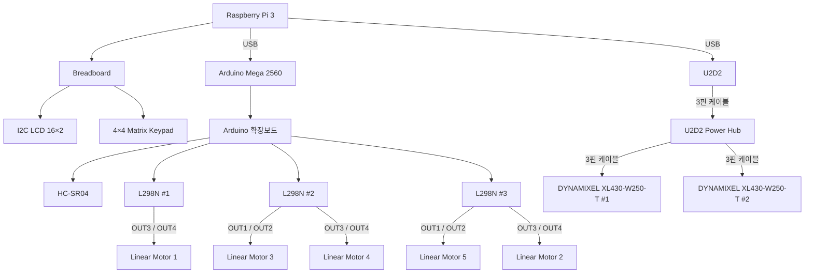

# Smart Seat System Wiring Diagram

본 문서는 실제 제작 회로 및 Cirkit Designer 회로도를 기준으로 스마트 시트 시스템의 장치 간 결선 구조를 정리한다.

세부 GPIO 및 Arduino 핀 번호는 `03_Pinout_Table.md`, 전원 공급 및 분배 구조는 `02_Power_Distribution_SMPS.md`에서 관리한다.

---

## 1. 전체 시스템 결선 구조



---

## 2. Raspberry Pi 3 주변 장치 결선

Raspberry Pi 3는 시스템의 메인 컨트롤러로 사용한다.

I2C LCD와 4×4 Matrix Keypad는 Raspberry Pi GPIO에 연결되며, 실제 회로에서는 Breadboard를 이용하여 배선을 구성한다.

```text
                 Raspberry Pi 3
                       │
                       │ GPIO / 전원
                       ▼
                   Breadboard
                    │      │
                    │      │
                    ▼      ▼
                I2C LCD   4×4 Keypad
```

### 연결 요약

| 시작 장치 | 연결 대상 | 연결 방식 | 역할 |
|---|---|---|---|
| Raspberry Pi 3 | Breadboard | GPIO / 전원 배선 | 주변 장치 연결 |
| Breadboard | I2C LCD 16×2 | I2C / 전원 | 화면 출력 |
| Breadboard | 4×4 Matrix Keypad | GPIO | 사용자 입력 |

> 실제 Raspberry Pi GPIO 번호는 `03_Pinout_Table.md`에서 관리한다.

---

## 3. Raspberry Pi 3 ↔ Arduino Mega 2560

Raspberry Pi 3와 Arduino Mega 2560은 USB 케이블로 연결한다.

```text
Raspberry Pi 3
      │
      │ USB
      ▼
Arduino Mega 2560
```

이 연결을 통해 Raspberry Pi와 Arduino 사이의 Serial 통신을 수행한다.

Arduino Mega는 리니어 모터 제어 및 초음파 센서 처리를 담당한다.

---

## 4. Arduino Mega 2560 ↔ Arduino 확장보드

실제 시스템에서는 Arduino Mega 2560에 확장보드를 사용한다.

```text
Arduino Mega 2560
        │
        ▼
  Arduino 확장보드
```

확장보드는 Arduino의 제어 핀과 외부 장치 간 배선을 편리하게 구성하기 위해 사용한다.

확장보드를 통해 다음 장치가 연결된다.

```text
Arduino 확장보드
        │
        ├──→ HC-SR04
        │
        ├──→ L298N #1
        │
        ├──→ L298N #2
        │
        └──→ L298N #3
```

> 프로그램에서는 Arduino Mega의 기존 Digital Pin 번호를 그대로 사용한다.

---

## 5. HC-SR04 결선

HC-SR04 초음파 센서는 Arduino Mega 2560의 확장보드를 통해 연결한다.

```text
Arduino Mega 2560
        │
        ▼
  Arduino 확장보드
        │
        ▼
     HC-SR04
```

HC-SR04에는 다음 신호 및 전원이 연결된다.

- VCC
- GND
- TRIG
- ECHO

상세 핀 번호는 `03_Pinout_Table.md`에서 관리한다.

---

## 6. Arduino ↔ L298N 결선

Arduino Mega의 모터 제어 신호는 Arduino 확장보드를 거쳐 3개의 L298N Motor Driver로 연결된다.

```text
                 Arduino Mega 2560
                         │
                         ▼
                   Arduino 확장보드
                         │
            ┌────────────┼────────────┐
            │            │            │
            ▼            ▼            ▼
        L298N #1      L298N #2      L298N #3
```

각 L298N에는 Arduino에서 다음 종류의 제어 신호가 전달된다.

- ENA / ENB
- IN1 ~ IN4

상세 Arduino 핀 번호는 `03_Pinout_Table.md`에서 관리한다.

---

## 7. L298N #1 ↔ Linear Motor 1

L298N #1은 Linear Motor 1을 제어한다.

Motor 1은 L298N #1의 B Channel을 사용한다.

```text
Arduino 확장보드
        │
        ▼
    L298N #1
        │
        │ B Channel
        │ OUT3 / OUT4
        ▼
 Linear Motor 1
```

| Motor Driver | Channel | Output | Motor |
|---|---|---|---|
| L298N #1 | B | OUT3 / OUT4 | Motor 1 |

L298N #1의 A Channel은 사용하지 않는다.

---

## 8. L298N #2 ↔ Linear Motor 3 / 4

L298N #2는 Linear Motor 3과 Linear Motor 4를 제어한다.

```text
              L298N #2
               │     │
       A Channel     B Channel
          │              │
     OUT1 / OUT2     OUT3 / OUT4
          │              │
          ▼              ▼
       Motor 3         Motor 4
```

| Motor Driver | Channel | Output | Motor |
|---|---|---|---|
| L298N #2 | A | OUT1 / OUT2 | Motor 3 |
| L298N #2 | B | OUT3 / OUT4 | Motor 4 |

---

## 9. L298N #3 ↔ Linear Motor 2 / 5

L298N #3은 Linear Motor 2와 Linear Motor 5를 제어한다.

```text
              L298N #3
               │     │
       A Channel     B Channel
          │              │
     OUT1 / OUT2     OUT3 / OUT4
          │              │
          ▼              ▼
       Motor 5         Motor 2
```

| Motor Driver | Channel | Output | Motor |
|---|---|---|---|
| L298N #3 | A | OUT1 / OUT2 | Motor 5 |
| L298N #3 | B | OUT3 / OUT4 | Motor 2 |

---

## 10. Linear Motor 전체 결선

```text
Arduino Mega 2560
        │
        ▼
  Arduino 확장보드
        │
        ├──────────────→ L298N #1
        │                   │
        │                   └── OUT3 / OUT4 → Motor 1
        │
        ├──────────────→ L298N #2
        │                   │
        │                   ├── OUT1 / OUT2 → Motor 3
        │                   └── OUT3 / OUT4 → Motor 4
        │
        └──────────────→ L298N #3
                            │
                            ├── OUT1 / OUT2 → Motor 5
                            └── OUT3 / OUT4 → Motor 2
```

### 모터 연결 요약

| Linear Motor | Motor Driver | Channel | Output |
|---|---|---|---|
| Motor 1 | L298N #1 | B | OUT3 / OUT4 |
| Motor 2 | L298N #3 | B | OUT3 / OUT4 |
| Motor 3 | L298N #2 | A | OUT1 / OUT2 |
| Motor 4 | L298N #2 | B | OUT3 / OUT4 |
| Motor 5 | L298N #3 | A | OUT1 / OUT2 |

---

## 11. Raspberry Pi 3 ↔ U2D2 결선

Raspberry Pi 3와 U2D2는 USB로 연결한다.

```text
Raspberry Pi 3
      │
      │ USB
      ▼
    U2D2
```

U2D2는 Raspberry Pi와 DYNAMIXEL 사이의 통신 인터페이스로 사용한다.

---

## 12. U2D2 ↔ U2D2 Power Hub

U2D2와 U2D2 Power Hub는 3핀 케이블로 연결한다.

```text
U2D2
  │
  │ 3핀 케이블
  ▼
U2D2 Power Hub
```

U2D2 Power Hub에는 DYNAMIXEL 모터 구동용 별도 외부 전원을 연결한다.

> 외부 전원의 상세 구성은 `02_Power_Distribution_SMPS.md`에서 관리한다.

---

## 13. U2D2 Power Hub ↔ DYNAMIXEL

DYNAMIXEL XL430-W250-T 2개는 각각 U2D2 Power Hub에 3핀 케이블로 연결한다.

```text
             U2D2 Power Hub
               │        │
               │        │
          3핀 케이블   3핀 케이블
               │        │
               ▼        ▼
        DYNAMIXEL #1  DYNAMIXEL #2
```

### 연결 요약

| 시작 장치 | 연결 대상 | 연결 방식 |
|---|---|---|
| Raspberry Pi 3 | U2D2 | USB |
| U2D2 | U2D2 Power Hub | 3핀 케이블 |
| U2D2 Power Hub | DYNAMIXEL #1 | 3핀 케이블 |
| U2D2 Power Hub | DYNAMIXEL #2 | 3핀 케이블 |

---

## 14. DYNAMIXEL 전체 결선 구조

```text
Raspberry Pi 3
      │
      │ USB
      ▼
    U2D2
      │
      │ 3핀 케이블
      ▼
U2D2 Power Hub
      │
      ├── 3핀 케이블 ──→ DYNAMIXEL XL430-W250-T #1
      │
      └── 3핀 케이블 ──→ DYNAMIXEL XL430-W250-T #2

      ▲
      │
      └── 별도 외부 전원
```

Raspberry Pi USB와 DYNAMIXEL 구동용 외부 전원은 서로 역할이 다르다.

- Raspberry Pi ↔ U2D2 : USB 통신
- U2D2 ↔ Power Hub : DYNAMIXEL 통신
- 별도 외부 전원 → Power Hub : DYNAMIXEL 구동 전원
- Power Hub ↔ DYNAMIXEL : 통신 및 전원 전달

---

## 15. 전체 시스템 결선 요약

```text
Raspberry Pi 3
│
├── Breadboard
│      │
│      ├──→ I2C LCD 16×2
│      └──→ 4×4 Matrix Keypad
│
├── USB
│    │
│    └──→ Arduino Mega 2560
│              │
│              ▼
│        Arduino 확장보드
│              │
│              ├──→ HC-SR04
│              │
│              ├──→ L298N #1
│              │       └──→ Motor 1
│              │
│              ├──→ L298N #2
│              │       ├──→ Motor 3
│              │       └──→ Motor 4
│              │
│              └──→ L298N #3
│                      ├──→ Motor 5
│                      └──→ Motor 2
│
└── USB
     │
     └──→ U2D2
             │
             │ 3핀
             ▼
       U2D2 Power Hub
             │
             ├──→ DYNAMIXEL #1
             └──→ DYNAMIXEL #2
```

---

## 16. 주요 장치 결선 요약표

| 시작 장치 | 연결 대상 | 연결 방식 |
|---|---|---|
| Raspberry Pi 3 | Breadboard | GPIO / 전원 배선 |
| Breadboard | I2C LCD | I2C |
| Breadboard | 4×4 Matrix Keypad | GPIO |
| Raspberry Pi 3 | Arduino Mega 2560 | USB |
| Arduino Mega | Arduino 확장보드 | Board Direct Connection |
| Arduino 확장보드 | HC-SR04 | Signal / Power |
| Arduino 확장보드 | L298N #1 | Control Signal |
| Arduino 확장보드 | L298N #2 | Control Signal |
| Arduino 확장보드 | L298N #3 | Control Signal |
| L298N #1 | Motor 1 | OUT3 / OUT4 |
| L298N #2 | Motor 3 | OUT1 / OUT2 |
| L298N #2 | Motor 4 | OUT3 / OUT4 |
| L298N #3 | Motor 5 | OUT1 / OUT2 |
| L298N #3 | Motor 2 | OUT3 / OUT4 |
| Raspberry Pi 3 | U2D2 | USB |
| U2D2 | U2D2 Power Hub | 3핀 케이블 |
| U2D2 Power Hub | DYNAMIXEL #1 | 3핀 케이블 |
| U2D2 Power Hub | DYNAMIXEL #2 | 3핀 케이블 |

---

## 17. 문서 관리 기준

```text
electric/
├── 01_Wiring_Diagram.md
├── 02_Power_Distribution_SMPS.md
└── 03_Pinout_Table.md
```

### `01_Wiring_Diagram.md`

장치 간 실제 물리적 연결 관계를 관리한다.

- Breadboard
- Arduino 확장보드
- Raspberry Pi ↔ 주변 장치
- Raspberry Pi ↔ Arduino
- Arduino ↔ HC-SR04
- Arduino ↔ L298N
- L298N ↔ Linear Motor
- Raspberry Pi ↔ U2D2
- U2D2 ↔ Power Hub ↔ DYNAMIXEL

### `02_Power_Distribution_SMPS.md`

전원의 공급 및 분배 구조를 관리한다.

- Raspberry Pi 전원
- Arduino 전원
- HC-SR04 전원
- 12V SMPS
- L298N / Linear Motor 전원
- U2D2 Power Hub 외부 전원
- DYNAMIXEL 구동 전원

### `03_Pinout_Table.md`

실제 제어 핀 번호를 관리한다.

- Raspberry Pi GPIO
- LCD SDA / SCL
- Keypad ROW / COL
- Arduino Digital Pin
- HC-SR04 TRIG / ECHO
- L298N ENA / ENB
- L298N IN1 ~ IN4
- Motor별 제어 핀
