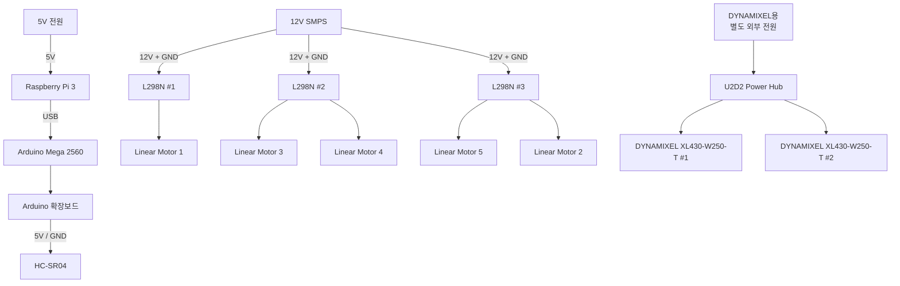
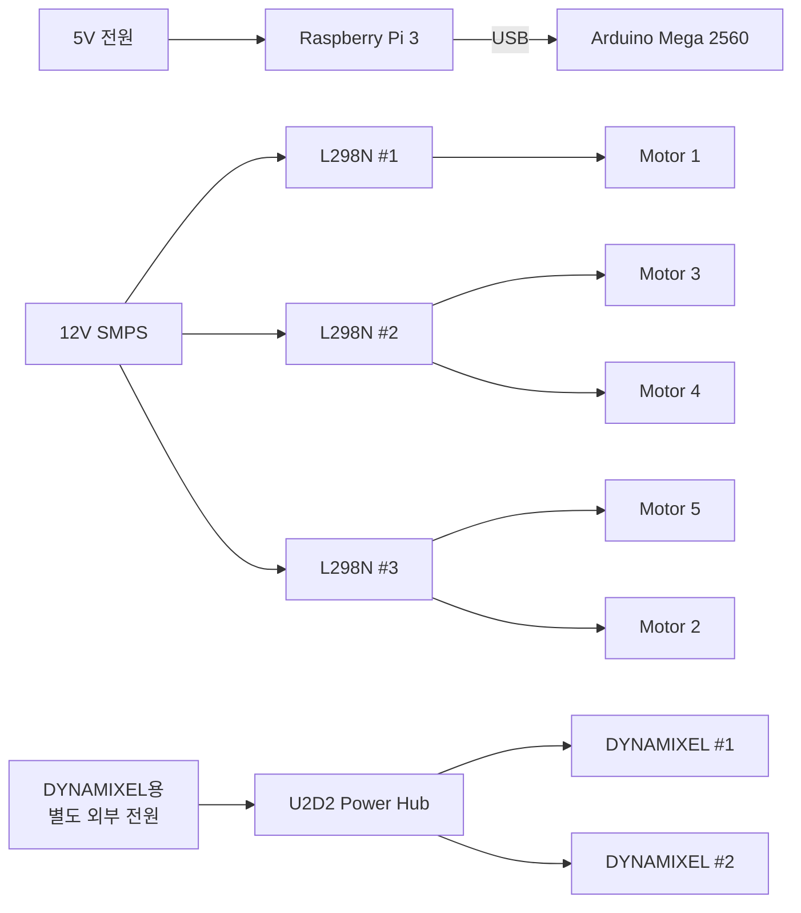

# Smart Seat System Power Distribution

본 문서는 스마트 시트 시스템의 전원 공급 및 분배 구조를 정리한다.

장치 간 물리적 연결은 `01_Wiring_Diagram.md`, GPIO 및 Arduino 제어 핀 정보는 `03_Pinout_Table.md`에서 관리한다.

---

## 1. 전체 전원 계통

스마트 시트 시스템의 전원은 크게 다음 3개의 계통으로 구성한다.

1. Raspberry Pi / 제어 계통
2. Linear Motor 구동 계통
3. DYNAMIXEL 구동 계통



> U2D2는 DYNAMIXEL 통신 인터페이스이므로 위 전원 흐름도에서는 구동 전원 계통과 분리하였다. U2D2의 실제 통신 결선은 `01_Wiring_Diagram.md`에서 관리한다.

---

## 2. 전원 계통 구분

```text
[1] Raspberry Pi / 제어 계통

5V 전원
   │
   ▼
Raspberry Pi 3
   │
   └── USB ──→ Arduino Mega 2560
                    │
                    ▼
              Arduino 확장보드
                    │
                    └──→ HC-SR04


[2] Linear Motor 구동 계통

12V SMPS
   │
   ├──→ L298N #1 ──→ Motor 1
   │
   ├──→ L298N #2 ──→ Motor 3 / Motor 4
   │
   └──→ L298N #3 ──→ Motor 5 / Motor 2


[3] DYNAMIXEL 구동 계통

DYNAMIXEL용 별도 외부 전원
              │
              ▼
       U2D2 Power Hub
          │        │
          ▼        ▼
    DYNAMIXEL #1  DYNAMIXEL #2
```

---

## 3. Raspberry Pi 3 전원 계통

Raspberry Pi 3는 별도의 5V 전원을 사용한다.

본 시스템에서는 12V → 5V DC-DC 컨버터를 사용하지 않는다.

```text
5V 전원
   │
   ▼
Raspberry Pi 3
```

Raspberry Pi 3는 시스템의 메인 컨트롤러로 사용한다.

---

## 4. Arduino Mega 2560 전원

Arduino Mega 2560은 Raspberry Pi 3와 USB로 연결한다.

```text
5V 전원
   │
   ▼
Raspberry Pi 3
   │
   │ USB
   ▼
Arduino Mega 2560
```

USB 연결은 다음 두 가지 역할을 한다.

- Raspberry Pi ↔ Arduino Serial 통신
- Arduino 로직 전원 공급

Linear Motor의 구동 전원은 Arduino에서 공급하지 않는다.

---

## 5. Arduino 확장보드 및 HC-SR04 전원

Arduino Mega 2560에 장착된 확장보드를 통해 HC-SR04를 연결한다.

```text
Arduino Mega 2560
        │
        ▼
  Arduino 확장보드
        │
        │ 5V / GND
        ▼
     HC-SR04
```

HC-SR04는 Arduino 계통의 5V와 GND를 사용한다.

별도의 12V 구동 전원은 사용하지 않는다.

---

## 6. 12V SMPS 전원 분배

Linear Motor 5개의 구동 전원은 12V SMPS에서 공급한다.

SMPS의 +12V와 GND를 3개의 L298N Motor Driver에 분배한다.

```text
                       12V SMPS
                          │
                    +12V / GND
                          │
              ┌───────────┼───────────┐
              │           │           │
              ▼           ▼           ▼
          L298N #1    L298N #2    L298N #3
```

Arduino는 L298N에 제어 신호만 전달하며, 실제 Linear Motor의 구동 전력은 12V SMPS에서 공급한다.

---

## 7. L298N #1 전원 계통

L298N #1은 12V SMPS에서 전원을 공급받아 Linear Motor 1을 구동한다.

```text
12V SMPS
   │
   │ 12V + GND
   ▼
L298N #1
   │
   ▼
Motor 1
```

---

## 8. L298N #2 전원 계통

L298N #2는 12V SMPS에서 전원을 공급받아 Linear Motor 3과 Motor 4를 구동한다.

```text
             12V SMPS
                │
                │ 12V + GND
                ▼
            L298N #2
             │     │
             ▼     ▼
         Motor 3  Motor 4
```

---

## 9. L298N #3 전원 계통

L298N #3은 12V SMPS에서 전원을 공급받아 Linear Motor 5와 Motor 2를 구동한다.

```text
             12V SMPS
                │
                │ 12V + GND
                ▼
            L298N #3
             │     │
             ▼     ▼
         Motor 5  Motor 2
```

---

## 10. Linear Motor 전체 전원 분배

```text
                         12V SMPS
                            │
                      +12V / GND
                            │
                 ┌──────────┼──────────┐
                 │          │          │
                 ▼          ▼          ▼
             L298N #1   L298N #2   L298N #3
                 │        │   │       │   │
                 ▼        ▼   ▼       ▼   ▼
              Motor 1  Motor 3 4   Motor 5 2
```

### 전원 분배 요약

| 전원 공급원 | Motor Driver | 연결 Motor |
|---|---|---|
| 12V SMPS | L298N #1 | Motor 1 |
| 12V SMPS | L298N #2 | Motor 3, Motor 4 |
| 12V SMPS | L298N #3 | Motor 5, Motor 2 |

---

## 11. Linear Motor 제어 전원과 구동 전원 구분

Linear Motor 계통에서는 Arduino의 제어 신호와 SMPS의 구동 전원을 구분한다.

```text
Arduino Mega 2560
        │
        │ 제어 신호
        ▼
      L298N
        ▲
        │
        │ 12V 구동 전원
        │
     12V SMPS
        │
        ▼
  Linear Motor
```

Arduino Mega는 모터를 직접 구동하지 않는다.

Arduino는 L298N에 PWM 및 방향 제어 신호를 전달하고, 실제 모터 구동에 필요한 전력은 12V SMPS에서 공급한다.

---

## 12. U2D2 계통

Raspberry Pi 3와 U2D2는 USB로 연결한다.

```text
Raspberry Pi 3
      │
      │ USB
      ▼
    U2D2
```

U2D2는 Raspberry Pi와 DYNAMIXEL 사이의 통신 인터페이스 역할을 한다.

DYNAMIXEL의 모터 구동 전원은 Raspberry Pi USB에서 공급하지 않는다.

---

## 13. U2D2 Power Hub 외부 전원

U2D2 Power Hub에는 DYNAMIXEL 구동을 위한 별도의 외부 전원 장치를 연결한다.

```text
DYNAMIXEL용 별도 외부 전원
              │
              ▼
       U2D2 Power Hub
          │        │
          ▼        ▼
    DYNAMIXEL #1  DYNAMIXEL #2
```

U2D2 Power Hub는 별도 외부 전원을 DYNAMIXEL 계통에 분배한다.

---

## 14. DYNAMIXEL 통신과 전원 구분

DYNAMIXEL 계통에서는 통신 경로와 구동 전원 경로를 구분한다.

```text
[통신 경로]

Raspberry Pi 3
      │
      │ USB
      ▼
    U2D2
      │
      │ 3핀
      ▼
U2D2 Power Hub
      │
      ├──→ DYNAMIXEL #1
      └──→ DYNAMIXEL #2


[구동 전원 경로]

별도 외부 전원
      │
      ▼
U2D2 Power Hub
      │
      ├──→ DYNAMIXEL #1
      └──→ DYNAMIXEL #2
```

즉,

- Raspberry Pi → U2D2 : 통신 인터페이스
- U2D2 → Power Hub : DYNAMIXEL 통신
- 외부 전원 → Power Hub : DYNAMIXEL 구동 전원
- Power Hub → DYNAMIXEL : 통신 및 구동 전원 전달

---

## 15. 전체 전원 흐름

```text
================================================
          Raspberry Pi / Control Power
================================================

5V 전원
   │
   ▼
Raspberry Pi 3
   │
   └── USB ──→ Arduino Mega 2560
                    │
                    └──→ HC-SR04


================================================
             Linear Motor Power
================================================

12V SMPS
   │
   ├──→ L298N #1
   │        └──→ Motor 1
   │
   ├──→ L298N #2
   │        ├──→ Motor 3
   │        └──→ Motor 4
   │
   └──→ L298N #3
            ├──→ Motor 5
            └──→ Motor 2


================================================
              DYNAMIXEL Power
================================================

별도 외부 전원
      │
      ▼
U2D2 Power Hub
      │
      ├──→ DYNAMIXEL #1
      └──→ DYNAMIXEL #2
```

---

## 16. 전체 전원 계통 요약표

| 장치 | 전원 공급원 | 공급 방식 | 용도 |
|---|---|---|---|
| Raspberry Pi 3 | 별도 5V 전원 | 직접 공급 | 메인 컨트롤러 |
| Arduino Mega 2560 | Raspberry Pi 3 | USB | Arduino 로직 전원 |
| Arduino 확장보드 | Arduino Mega | 보드 연결 | 배선 확장 |
| HC-SR04 | Arduino 계통 | 5V / GND | 센서 전원 |
| L298N #1 | 12V SMPS | 12V + GND | Motor 1 구동 |
| L298N #2 | 12V SMPS | 12V + GND | Motor 3 / 4 구동 |
| L298N #3 | 12V SMPS | 12V + GND | Motor 5 / 2 구동 |
| Motor 1 | L298N #1 | Motor Output | 구동 전원 |
| Motor 2 | L298N #3 | Motor Output | 구동 전원 |
| Motor 3 | L298N #2 | Motor Output | 구동 전원 |
| Motor 4 | L298N #2 | Motor Output | 구동 전원 |
| Motor 5 | L298N #3 | Motor Output | 구동 전원 |
| U2D2 | Raspberry Pi 3 | USB | 통신 인터페이스 |
| U2D2 Power Hub | 별도 외부 전원 | 외부 전원 입력 | DYNAMIXEL 전원 분배 |
| DYNAMIXEL #1 | U2D2 Power Hub | 3핀 | 통신 / 구동 전원 |
| DYNAMIXEL #2 | U2D2 Power Hub | 3핀 | 통신 / 구동 전원 |

---

## 17. 전원 계통 핵심 구조



---

## 18. 문서 관리 기준

```text
electric/
├── 01_Wiring_Diagram.md
├── 02_Power_Distribution_SMPS.md
└── 03_Pinout_Table.md
```

### `01_Wiring_Diagram.md`

장치 간 실제 물리적 연결 관계를 관리한다.

- Breadboard
- Arduino 확장보드
- Raspberry Pi ↔ Arduino
- Arduino ↔ HC-SR04
- Arduino ↔ L298N
- L298N ↔ Linear Motor
- Raspberry Pi ↔ U2D2
- U2D2 ↔ Power Hub ↔ DYNAMIXEL

### `02_Power_Distribution_SMPS.md`

전원 공급원과 전원 분배 경로를 관리한다.

- Raspberry Pi 5V 전원
- Arduino USB 전원
- HC-SR04 전원
- 12V SMPS
- L298N / Linear Motor 구동 전원
- U2D2 Power Hub 별도 외부 전원
- DYNAMIXEL 구동 전원

### `03_Pinout_Table.md`

실제 제어 핀 번호를 관리한다.

- Raspberry Pi GPIO
- LCD SDA / SCL
- Keypad ROW / COL
- Arduino Digital Pin
- HC-SR04 TRIG / ECHO
- L298N ENA / ENB
- L298N IN1 ~ IN4
- Motor별 제어 핀
