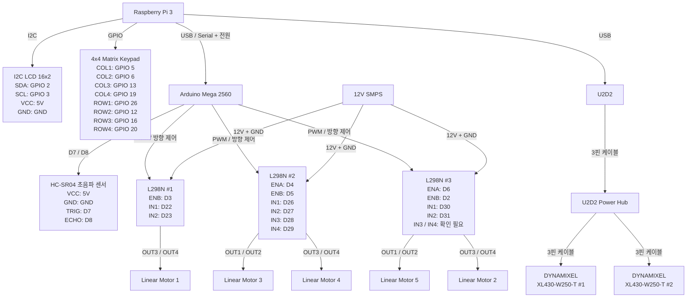

# 스마트 시트 전체 결선도



---

## 주요 연결 요약

| 제어 장치 | 연결 대상 | 연결 방식 |
|---|---|---|
| Raspberry Pi 3 | Arduino Mega 2560 | USB |
| Raspberry Pi 3 | I2C LCD | GPIO 2 / GPIO 3 |
| Raspberry Pi 3 | 4×4 Matrix Keypad | GPIO |
| Raspberry Pi 3 | U2D2 | USB |
| Arduino Mega | HC-SR04 | D7 / D8 |
| Arduino Mega | L298N #1 | PWM + 방향 제어 |
| Arduino Mega | L298N #2 | PWM + 방향 제어 |
| Arduino Mega | L298N #3 | PWM + 방향 제어 |
| L298N #1 | Linear Motor 1 | OUT3 / OUT4 |
| L298N #2 | Linear Motor 3 | OUT1 / OUT2 |
| L298N #2 | Linear Motor 4 | OUT3 / OUT4 |
| L298N #3 | Linear Motor 2 | OUT3 / OUT4 |
| L298N #3 | Linear Motor 5 | OUT1 / OUT2 |
| U2D2 | U2D2 Power Hub | 3핀 케이블 |
| U2D2 Power Hub | DYNAMIXEL #1 | 3핀 케이블 |
| U2D2 Power Hub | DYNAMIXEL #2 | 3핀 케이블 |
| 12V SMPS | L298N #1 / #2 / #3 | 12V + GND |
# 스마트 시트 시스템 핀맵

## 1. 시스템 구성

| 장치                     | 수량 | 역할                      |
| ---------------------- | -: | ----------------------- |
| Raspberry Pi 3         |  1 | 메인 컨트롤러                 |
| Arduino Mega 2560      |  1 | 리니어 모터 및 초음파 센서 제어      |
| 4×4 Matrix Keypad      |  1 | 사용자 입력                  |
| I2C LCD 16×2           |  1 | 사용자 정보 및 시스템 상태 표시      |
| HC-SR04                |  1 | 초음파 거리 측정               |
| L298N                  |  3 | 리니어 모터 구동               |
| Linear Motor           |  5 | 등받이 형상 조절               |
| U2D2                   |  1 | DYNAMIXEL 통신 인터페이스      |
| U2D2 Power Hub         |  1 | DYNAMIXEL 연결 및 전원/통신 분배 |
| DYNAMIXEL XL430-W250-T |  2 | 벨트 위치 조절                |
| 12V SMPS               |  1 | L298N 및 리니어 모터 구동 전원    |

---

# 2. Raspberry Pi 3 핀맵

## 2-1. I2C LCD 16×2

| LCD 핀 | Raspberry Pi 3 |  물리 핀 | 역할      |
| ----- | -------------- | ----: | ------- |
| VCC   | 5V             | Pin 2 | LCD 전원  |
| GND   | GND            | Pin 6 | 접지      |
| SDA   | GPIO 2 (SDA1)  | Pin 3 | I2C 데이터 |
| SCL   | GPIO 3 (SCL1)  | Pin 5 | I2C 클럭  |

* I2C 주소: `0x27`

---

## 2-2. 4×4 Matrix Keypad

| Keypad 핀 | Raspberry Pi 3 GPIO |   물리 핀 |
| -------- | ------------------- | -----: |
| COL1     | GPIO 5              | Pin 29 |
| COL2     | GPIO 6              | Pin 31 |
| COL3     | GPIO 13             | Pin 33 |
| COL4     | GPIO 19             | Pin 35 |
| ROW1     | GPIO 26             | Pin 37 |
| ROW2     | GPIO 12             | Pin 32 |
| ROW3     | GPIO 16             | Pin 36 |
| ROW4     | GPIO 20             | Pin 38 |

---

## 2-3. Raspberry Pi 3 ↔ Arduino Mega 2560

| Raspberry Pi 3 | Arduino Mega 2560 | 연결 방식   | 역할                        |
| -------------- | ----------------- | ------- | ------------------------- |
| USB Port       | USB Port          | USB 케이블 | Serial 통신 + Arduino 전원 공급 |

---

## 2-4. Raspberry Pi 3 ↔ U2D2

| Raspberry Pi 3 | U2D2     | 연결 방식   | 역할                     |
| -------------- | -------- | ------- | ---------------------- |
| USB Port       | USB Port | USB 케이블 | DYNAMIXEL 통신 + U2D2 전원 |

* U2D2 장치 포트: `/dev/ttyUSB1`

---

# 3. Arduino Mega 2560 핀맵

## 3-1. 리니어 모터 PWM 제어

| Arduino 핀 | L298N    | 채널  | 연결 모터   | 역할        |
| --------- | -------- | --- | ------- | --------- |
| D2        | L298N #3 | ENB | Motor 2 | PWM 속도 제어 |
| D3        | L298N #1 | ENB | Motor 1 | PWM 속도 제어 |
| D4        | L298N #2 | ENA | Motor 3 | PWM 속도 제어 |
| D5        | L298N #2 | ENB | Motor 4 | PWM 속도 제어 |
| D6        | L298N #3 | ENA | Motor 5 | PWM 속도 제어 |

---

## 3-2. L298N 방향 제어 핀

| Arduino 핀 | L298N    | L298N 입력 | 제어 대상         |
| --------- | -------- | -------- | ------------- |
| D22       | L298N #1 | IN1      | Motor 1 방향 제어 |
| D23       | L298N #1 | IN2      | Motor 1 방향 제어 |
| D24       | L298N #1 | IN3      | 미사용 채널        |
| D25       | L298N #1 | IN4      | 미사용 채널        |
| D26       | L298N #2 | IN1      | Motor 3 방향 제어 |
| D27       | L298N #2 | IN2      | Motor 3 방향 제어 |
| D28       | L298N #2 | IN3      | Motor 4 방향 제어 |
| D29       | L298N #2 | IN4      | Motor 4 방향 제어 |
| D30       | L298N #3 | IN1      | Motor 5 방향 제어 |
| D31       | L298N #3 | IN2      | Motor 5 방향 제어 |

> L298N #3의 Motor 2는 B 채널(OUT3/OUT4)을 사용하므로 IN3/IN4 방향 제어 핀이 추가로 필요하다. 실제 Arduino 연결 핀 번호가 확인되면 해당 핀을 추가한다.

---

## 3-3. HC-SR04 초음파 센서

| HC-SR04 핀 | Arduino Mega 2560 | 역할         |
| --------- | ----------------- | ---------- |
| VCC       | 5V                | 센서 전원      |
| GND       | GND               | 접지         |
| TRIG      | D7                | 초음파 송신 트리거 |
| ECHO      | D8                | 초음파 수신 신호  |

---

# 4. L298N ↔ Linear Motor 연결

## L298N #1

| L298N 출력    | 연결 대상      | 사용 채널  |
| ----------- | ---------- | ------ |
| OUT3 / OUT4 | Motor 1    | B 채널   |
| ENB         | Arduino D3 | PWM 제어 |

---

## L298N #2

| L298N 출력    | 연결 대상      | 사용 채널  |
| ----------- | ---------- | ------ |
| OUT1 / OUT2 | Motor 3    | A 채널   |
| ENA         | Arduino D4 | PWM 제어 |
| OUT3 / OUT4 | Motor 4    | B 채널   |
| ENB         | Arduino D5 | PWM 제어 |

---

## L298N #3

| L298N 출력    | 연결 대상      | 사용 채널  |
| ----------- | ---------- | ------ |
| OUT1 / OUT2 | Motor 5    | A 채널   |
| ENA         | Arduino D6 | PWM 제어 |
| OUT3 / OUT4 | Motor 2    | B 채널   |
| ENB         | Arduino D2 | PWM 제어 |

---

# 5. 모터별 최종 핀맵

| 모터      | L298N    | 출력          | Enable | Arduino PWM |
| ------- | -------- | ----------- | ------ | ----------- |
| Motor 1 | L298N #1 | OUT3 / OUT4 | ENB    | D3          |
| Motor 2 | L298N #3 | OUT3 / OUT4 | ENB    | D2          |
| Motor 3 | L298N #2 | OUT1 / OUT2 | ENA    | D4          |
| Motor 4 | L298N #2 | OUT3 / OUT4 | ENB    | D5          |
| Motor 5 | L298N #3 | OUT1 / OUT2 | ENA    | D6          |

---

# 6. L298N 전원 핀

3개의 L298N은 12V SMPS를 통해 리니어 모터 구동 전원을 공급받는다.

| L298N 핀   | 연결 대상        | 역할       |
| --------- | ------------ | -------- |
| +12V      | 12V SMPS +   | 모터 구동 전원 |
| GND       | 12V SMPS GND | 모터 전원 접지 |
| OUT1~OUT4 | Linear Motor | 모터 출력    |

전원 분배:

```text
12V SMPS
├── L298N #1 → Motor 1
├── L298N #2 → Motor 3, Motor 4
└── L298N #3 → Motor 2, Motor 5
```

---

# 7. U2D2 / DYNAMIXEL 연결

## 7-1. U2D2 연결

| 장치             | 연결 대상          | 연결 방식  |
| -------------- | -------------- | ------ |
| Raspberry Pi 3 | U2D2           | USB    |
| U2D2           | U2D2 Power Hub | 3핀 케이블 |

---

## 7-2. DYNAMIXEL 연결

| 장치             | 연결 대상                     | 연결 방식  |
| -------------- | ------------------------- | ------ |
| U2D2 Power Hub | DYNAMIXEL XL430-W250-T #1 | 3핀 케이블 |
| U2D2 Power Hub | DYNAMIXEL XL430-W250-T #2 | 3핀 케이블 |

통신 연결 구조:

```text
Raspberry Pi 3
      │
      │ USB
      ▼
    U2D2
      │
      │ 3핀 케이블
      ▼
U2D2 Power Hub
      ├── 3핀 케이블 ──→ DYNAMIXEL XL430 #1
      │
      └── 3핀 케이블 ──→ DYNAMIXEL XL430 #2
```

> Raspberry Pi 3의 USB는 U2D2 인터페이스의 전원 및 통신에 사용된다.
> DYNAMIXEL 모터의 구동 전원 구성은 실제 U2D2 Power Hub의 전원 입력 방식을 확인한 뒤 `전원 계통도.md`에서 별도로 명시한다.

---

# 8. HC-SR04 연결 구조

```text
Arduino Mega 2560
├── 5V  ─────→ HC-SR04 VCC
├── GND ─────→ HC-SR04 GND
├── D7  ─────→ HC-SR04 TRIG
└── D8  ─────→ HC-SR04 ECHO
```

---

# 9. 전체 통신 및 제어 구조

```text
                         Raspberry Pi 3
                    ┌──────────┼──────────┐
                    │          │          │
                  GPIO        I2C        USB
                    │          │          │
                    ▼          ▼          ▼
              4×4 Keypad    I2C LCD   Arduino Mega
                                         │
                           ┌─────────────┴─────────────┐
                           │                           │
                           ▼                           ▼
                       HC-SR04                     L298N ×3
                       D7 / D8                        │
                                              Linear Motor ×5


Raspberry Pi 3
      │
      │ USB
      ▼
    U2D2
      │
      │ 3핀
      ▼
U2D2 Power Hub
      ├── 3핀 ──→ DYNAMIXEL #1
      └── 3핀 ──→ DYNAMIXEL #2
```

---

# 10. 전체 Arduino 핀 요약

| Arduino Mega 핀 | 연결 대상        | 역할          |
| -------------- | ------------ | ----------- |
| D2             | L298N #3 ENB | Motor 2 PWM |
| D3             | L298N #1 ENB | Motor 1 PWM |
| D4             | L298N #2 ENA | Motor 3 PWM |
| D5             | L298N #2 ENB | Motor 4 PWM |
| D6             | L298N #3 ENA | Motor 5 PWM |
| D7             | HC-SR04 TRIG | 초음파 송신      |
| D8             | HC-SR04 ECHO | 초음파 수신      |
| D22            | L298N #1 IN1 | Motor 1 방향  |
| D23            | L298N #1 IN2 | Motor 1 방향  |
| D24            | L298N #1 IN3 | 미사용 채널      |
| D25            | L298N #1 IN4 | 미사용 채널      |
| D26            | L298N #2 IN1 | Motor 3 방향  |
| D27            | L298N #2 IN2 | Motor 3 방향  |
| D28            | L298N #2 IN3 | Motor 4 방향  |
| D29            | L298N #2 IN4 | Motor 4 방향  |
| D30            | L298N #3 IN1 | Motor 5 방향  |
| D31            | L298N #3 IN2 | Motor 5 방향  |
| 5V             | HC-SR04 VCC  | 센서 전원       |
| GND            | HC-SR04 GND  | 센서 접지       |

---

# 11. 전체 Raspberry Pi 3 핀 요약

| Raspberry Pi 3 |   물리 핀 | 연결 대상        |
| -------------- | -----: | ------------ |
| 5V             |  Pin 2 | LCD VCC      |
| GPIO 2         |  Pin 3 | LCD SDA      |
| GPIO 3         |  Pin 5 | LCD SCL      |
| GND            |  Pin 6 | LCD GND      |
| GPIO 5         | Pin 29 | Keypad COL1  |
| GPIO 6         | Pin 31 | Keypad COL2  |
| GPIO 13        | Pin 33 | Keypad COL3  |
| GPIO 19        | Pin 35 | Keypad COL4  |
| GPIO 26        | Pin 37 | Keypad ROW1  |
| GPIO 12        | Pin 32 | Keypad ROW2  |
| GPIO 16        | Pin 36 | Keypad ROW3  |
| GPIO 20        | Pin 38 | Keypad ROW4  |
| USB            |      - | Arduino Mega |
| USB            |      - | U2D2         |
