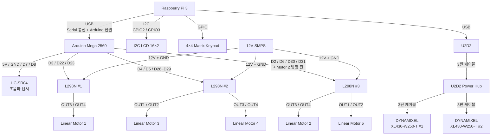

# 스마트 시트 시스템 결선도

## 1. 전체 시스템 결선도



---

# 2. Raspberry Pi 3 결선

## 2-1. I2C LCD 16×2

| Raspberry Pi 3 |  물리 핀 | LCD | 역할      |
| -------------- | ----: | --- | ------- |
| 5V             | Pin 2 | VCC | LCD 전원  |
| GND            | Pin 6 | GND | 접지      |
| GPIO 2         | Pin 3 | SDA | I2C 데이터 |
| GPIO 3         | Pin 5 | SCL | I2C 클럭  |

* I2C Address: `0x27`

### 연결

```text
Raspberry Pi 3              I2C LCD
────────────────────────────────────
5V       (Pin 2) ─────────→ VCC
GND      (Pin 6) ─────────→ GND
GPIO 2   (Pin 3) ─────────→ SDA
GPIO 3   (Pin 5) ─────────→ SCL
```

---

## 2-2. 4×4 Matrix Keypad

| Keypad | Raspberry Pi 3 |   물리 핀 |
| ------ | -------------- | -----: |
| COL1   | GPIO 5         | Pin 29 |
| COL2   | GPIO 6         | Pin 31 |
| COL3   | GPIO 13        | Pin 33 |
| COL4   | GPIO 19        | Pin 35 |
| ROW1   | GPIO 26        | Pin 37 |
| ROW2   | GPIO 12        | Pin 32 |
| ROW3   | GPIO 16        | Pin 36 |
| ROW4   | GPIO 20        | Pin 38 |

### 연결

```text
4×4 Keypad                 Raspberry Pi 3
──────────────────────────────────────────
COL1 ────────────────────→ GPIO 5
COL2 ────────────────────→ GPIO 6
COL3 ────────────────────→ GPIO 13
COL4 ────────────────────→ GPIO 19

ROW1 ────────────────────→ GPIO 26
ROW2 ────────────────────→ GPIO 12
ROW3 ────────────────────→ GPIO 16
ROW4 ────────────────────→ GPIO 20
```

---

# 3. Raspberry Pi 3 ↔ Arduino Mega 2560

Raspberry Pi 3와 Arduino Mega 2560은 USB 케이블로 연결한다.

```text
Raspberry Pi 3
      │
      │ USB
      │ Serial 통신 + Arduino 전원
      ▼
Arduino Mega 2560
```

| Raspberry Pi 3 | Arduino Mega | 역할                     |
| -------------- | ------------ | ---------------------- |
| USB Port       | USB Port     | Serial 통신 + Arduino 전원 |

---

# 4. HC-SR04 초음파 센서 결선

HC-SR04는 Arduino Mega 2560에 직접 연결한다.

| HC-SR04 | Arduino Mega | 역할      |
| ------- | ------------ | ------- |
| VCC     | 5V           | 센서 전원   |
| GND     | GND          | 접지      |
| TRIG    | D7           | Trigger |
| ECHO    | D8           | Echo    |

### 연결

```text
Arduino Mega 2560             HC-SR04
──────────────────────────────────────
5V  ───────────────────────→ VCC
GND ───────────────────────→ GND
D7  ───────────────────────→ TRIG
D8  ───────────────────────→ ECHO
```

---

# 5. Arduino Mega ↔ L298N ↔ Linear Motor

## 5-1. 모터 연결 요약

| Motor   | L298N    | Channel | 출력          | PWM |
| ------- | -------- | ------- | ----------- | --- |
| Motor 1 | L298N #1 | B       | OUT3 / OUT4 | D3  |
| Motor 2 | L298N #3 | B       | OUT3 / OUT4 | D2  |
| Motor 3 | L298N #2 | A       | OUT1 / OUT2 | D4  |
| Motor 4 | L298N #2 | B       | OUT3 / OUT4 | D5  |
| Motor 5 | L298N #3 | A       | OUT1 / OUT2 | D6  |

---

## 5-2. L298N #1 ↔ Motor 1

Motor 1은 L298N #1의 B 채널을 사용한다.

```text
Arduino Mega              L298N #1              Motor 1
────────────────────────────────────────────────────────
D3  ────────────────────→ ENB
D22 ────────────────────→ IN1
D23 ────────────────────→ IN2

                          OUT3 ────────────────→ Motor 1
                          OUT4 ────────────────→ Motor 1

12V SMPS + ─────────────→ +12V
12V SMPS GND ───────────→ GND
```

| Arduino | L298N #1 | 역할            |
| ------- | -------- | ------------- |
| D3      | ENB      | Motor 1 PWM   |
| D22     | IN1      | Motor 1 방향 제어 |
| D23     | IN2      | Motor 1 방향 제어 |

| L298N #1 | 연결 대상   |
| -------- | ------- |
| OUT3     | Motor 1 |
| OUT4     | Motor 1 |

---

## 5-3. L298N #2 ↔ Motor 3 / Motor 4

### Motor 3 — A Channel

```text
Arduino Mega              L298N #2              Motor 3
────────────────────────────────────────────────────────
D4  ────────────────────→ ENA
D26 ────────────────────→ IN1
D27 ────────────────────→ IN2

                          OUT1 ────────────────→ Motor 3
                          OUT2 ────────────────→ Motor 3
```

### Motor 4 — B Channel

```text
Arduino Mega              L298N #2              Motor 4
────────────────────────────────────────────────────────
D5  ────────────────────→ ENB
D28 ────────────────────→ IN3
D29 ────────────────────→ IN4

                          OUT3 ────────────────→ Motor 4
                          OUT4 ────────────────→ Motor 4
```

### L298N #2 전체 핀

| Arduino | L298N #2 | 대상          |
| ------- | -------- | ----------- |
| D4      | ENA      | Motor 3 PWM |
| D26     | IN1      | Motor 3 방향  |
| D27     | IN2      | Motor 3 방향  |
| D5      | ENB      | Motor 4 PWM |
| D28     | IN3      | Motor 4 방향  |
| D29     | IN4      | Motor 4 방향  |

| L298N #2    | 연결 대상        |
| ----------- | ------------ |
| OUT1 / OUT2 | Motor 3      |
| OUT3 / OUT4 | Motor 4      |
| +12V        | 12V SMPS +   |
| GND         | 12V SMPS GND |

---

## 5-4. L298N #3 ↔ Motor 2 / Motor 5

### Motor 5 — A Channel

```text
Arduino Mega              L298N #3              Motor 5
────────────────────────────────────────────────────────
D6  ────────────────────→ ENA
D30 ────────────────────→ IN1
D31 ────────────────────→ IN2

                          OUT1 ────────────────→ Motor 5
                          OUT2 ────────────────→ Motor 5
```

### Motor 2 — B Channel

```text
Arduino Mega              L298N #3              Motor 2
────────────────────────────────────────────────────────
D2  ────────────────────→ ENB

확인 필요 ──────────────→ IN3
확인 필요 ──────────────→ IN4

                          OUT3 ────────────────→ Motor 2
                          OUT4 ────────────────→ Motor 2
```

### L298N #3 전체 핀

| Arduino | L298N #3 | 대상          |
| ------- | -------- | ----------- |
| D6      | ENA      | Motor 5 PWM |
| D30     | IN1      | Motor 5 방향  |
| D31     | IN2      | Motor 5 방향  |
| D2      | ENB      | Motor 2 PWM |
| 확인 필요   | IN3      | Motor 2 방향  |
| 확인 필요   | IN4      | Motor 2 방향  |

| L298N #3    | 연결 대상        |
| ----------- | ------------ |
| OUT1 / OUT2 | Motor 5      |
| OUT3 / OUT4 | Motor 2      |
| +12V        | 12V SMPS +   |
| GND         | 12V SMPS GND |

---

# 6. 12V SMPS ↔ L298N 전원 결선

12V SMPS에서 L298N 3개로 모터 구동 전원을 분배한다.

```text
                     12V SMPS
                        │
          ┌─────────────┼─────────────┐
          │             │             │
          ▼             ▼             ▼
      L298N #1      L298N #2      L298N #3
          │           │   │          │   │
          ▼           ▼   ▼          ▼   ▼
       Motor 1     Motor 3 Motor 4 Motor 5 Motor 2
```

### 전원 연결

```text
12V SMPS (+)
├──→ L298N #1 +12V
├──→ L298N #2 +12V
└──→ L298N #3 +12V

12V SMPS (GND)
├──→ L298N #1 GND
├──→ L298N #2 GND
└──→ L298N #3 GND
```

---

# 7. U2D2 / U2D2 Power Hub / DYNAMIXEL 결선

Raspberry Pi 3와 U2D2는 USB 케이블로 연결한다.

U2D2와 U2D2 Power Hub는 3핀 케이블로 연결하며, 두 개의 DYNAMIXEL XL430-W250-T도 각각 3핀 케이블을 이용하여 U2D2 Power Hub에 연결한다.

```text
Raspberry Pi 3
      │
      │ USB
      ▼
    U2D2
      │
      │ 3핀 케이블
      ▼
U2D2 Power Hub
      │
      ├──── 3핀 케이블 ────→ DYNAMIXEL XL430-W250-T #1
      │
      └──── 3핀 케이블 ────→ DYNAMIXEL XL430-W250-T #2
```

| 시작 장치          | 연결 대상                     | 연결 방식  |
| -------------- | ------------------------- | ------ |
| Raspberry Pi 3 | U2D2                      | USB    |
| U2D2           | U2D2 Power Hub            | 3핀 케이블 |
| U2D2 Power Hub | DYNAMIXEL XL430-W250-T #1 | 3핀 케이블 |
| U2D2 Power Hub | DYNAMIXEL XL430-W250-T #2 | 3핀 케이블 |

> Raspberry Pi 3의 USB 연결은 U2D2의 통신 및 인터페이스 전원 연결에 사용한다. DYNAMIXEL 구동 전원에 관한 상세 구성은 실제 Power Hub 전원 입력 상태를 기준으로 `전원 계통도.md`에 별도로 작성한다.

---

# 8. 전체 결선 구조

```text
                              ┌──────────────────────┐
                              │    Raspberry Pi 3    │
                              └──────────┬───────────┘
                                         │
             ┌───────────────┬───────────┼───────────────┐
             │               │           │               │
            I2C             GPIO        USB             USB
             │               │           │               │
             ▼               ▼           ▼               ▼
        I2C LCD         4×4 Keypad  Arduino Mega        U2D2
                                      │                  │
                           ┌──────────┴──────────┐       │ 3핀
                           │                     │       ▼
                           ▼                     ▼   U2D2 Power Hub
                        HC-SR04              L298N ×3     │
                        D7 / D8                  │        ├── 3핀 → DYNAMIXEL #1
                                                 │        └── 3핀 → DYNAMIXEL #2
                             ┌───────────────────┼───────────────────┐
                             │                   │                   │
                             ▼                   ▼                   ▼
                         L298N #1            L298N #2            L298N #3
                             │                │     │             │     │
                             │                │     │             │     │
                             ▼                ▼     ▼             ▼     ▼
                          Motor 1          Motor 3 Motor 4      Motor 5 Motor 2
                             ▲                ▲     ▲             ▲     ▲
                             │                │     │             │     │
                             └────────────────┴──┬──┴─────────────┴─────┘
                                                │
                                             12V SMPS
```

---

# 9. 전체 결선 요약표

| 시작 장치          | 연결 대상          | 핀 / 연결 방식   |
| -------------- | -------------- | ----------- |
| Raspberry Pi 3 | LCD VCC        | 5V          |
| Raspberry Pi 3 | LCD GND        | GND         |
| Raspberry Pi 3 | LCD SDA        | GPIO 2      |
| Raspberry Pi 3 | LCD SCL        | GPIO 3      |
| Raspberry Pi 3 | Keypad COL1    | GPIO 5      |
| Raspberry Pi 3 | Keypad COL2    | GPIO 6      |
| Raspberry Pi 3 | Keypad COL3    | GPIO 13     |
| Raspberry Pi 3 | Keypad COL4    | GPIO 19     |
| Raspberry Pi 3 | Keypad ROW1    | GPIO 26     |
| Raspberry Pi 3 | Keypad ROW2    | GPIO 12     |
| Raspberry Pi 3 | Keypad ROW3    | GPIO 16     |
| Raspberry Pi 3 | Keypad ROW4    | GPIO 20     |
| Raspberry Pi 3 | Arduino Mega   | USB         |
| Raspberry Pi 3 | U2D2           | USB         |
| Arduino Mega   | HC-SR04 TRIG   | D7          |
| Arduino Mega   | HC-SR04 ECHO   | D8          |
| Arduino Mega   | HC-SR04 VCC    | 5V          |
| Arduino Mega   | HC-SR04 GND    | GND         |
| Arduino D3     | L298N #1 ENB   | Motor 1 PWM |
| Arduino D22    | L298N #1 IN1   | Motor 1 방향  |
| Arduino D23    | L298N #1 IN2   | Motor 1 방향  |
| L298N #1       | Motor 1        | OUT3 / OUT4 |
| Arduino D4     | L298N #2 ENA   | Motor 3 PWM |
| Arduino D26    | L298N #2 IN1   | Motor 3 방향  |
| Arduino D27    | L298N #2 IN2   | Motor 3 방향  |
| L298N #2       | Motor 3        | OUT1 / OUT2 |
| Arduino D5     | L298N #2 ENB   | Motor 4 PWM |
| Arduino D28    | L298N #2 IN3   | Motor 4 방향  |
| Arduino D29    | L298N #2 IN4   | Motor 4 방향  |
| L298N #2       | Motor 4        | OUT3 / OUT4 |
| Arduino D6     | L298N #3 ENA   | Motor 5 PWM |
| Arduino D30    | L298N #3 IN1   | Motor 5 방향  |
| Arduino D31    | L298N #3 IN2   | Motor 5 방향  |
| L298N #3       | Motor 5        | OUT1 / OUT2 |
| Arduino D2     | L298N #3 ENB   | Motor 2 PWM |
| Arduino 확인 필요  | L298N #3 IN3   | Motor 2 방향  |
| Arduino 확인 필요  | L298N #3 IN4   | Motor 2 방향  |
| L298N #3       | Motor 2        | OUT3 / OUT4 |
| 12V SMPS       | L298N #1       | +12V / GND  |
| 12V SMPS       | L298N #2       | +12V / GND  |
| 12V SMPS       | L298N #3       | +12V / GND  |
| U2D2           | U2D2 Power Hub | 3핀 케이블      |
| U2D2 Power Hub | DYNAMIXEL #1   | 3핀 케이블      |
| U2D2 Power Hub | DYNAMIXEL #2   | 3핀 케이블      |

---

## 미확정 사항

* L298N #3의 B 채널에서 Motor 2 방향을 제어하는 `IN3`, `IN4`의 Arduino Mega 핀 번호는 추가 확인이 필요하다.
