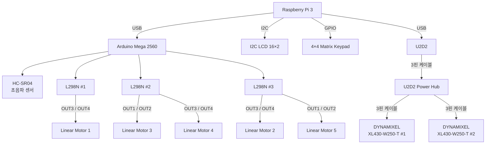

# 스마트 시트 시스템 결선도

## 1. 전체 시스템 결선도



---

## 2. Raspberry Pi 3 주변 장치 연결

Raspberry Pi 3는 시스템의 메인 컨트롤러로 사용한다.

```text
Raspberry Pi 3
│
├── I2C ──→ I2C LCD 16×2
│
├── GPIO ─→ 4×4 Matrix Keypad
│
├── USB ──→ Arduino Mega 2560
│
└── USB ──→ U2D2
```

### 연결 장치

| Raspberry Pi 3 연결 대상 | 연결 방식 | 역할                     |
| -------------------- | ----- | ---------------------- |
| I2C LCD 16×2         | I2C   | 사용자 정보 및 시스템 상태 표시     |
| 4×4 Matrix Keypad    | GPIO  | 사용자 입력                 |
| Arduino Mega 2560    | USB   | Serial 통신 및 Arduino 연결 |
| U2D2                 | USB   | DYNAMIXEL 통신           |

> Raspberry Pi의 상세 GPIO 번호는 `핀맵.md`에서 관리한다.

---

## 3. Arduino Mega 2560 주변 장치 연결

Arduino Mega 2560은 초음파 센서와 리니어 모터 구동부를 제어한다.

```text
Arduino Mega 2560
│
├──→ HC-SR04
│
├──→ L298N #1
│      └──→ Linear Motor 1
│
├──→ L298N #2
│      ├──→ Linear Motor 3
│      └──→ Linear Motor 4
│
└──→ L298N #3
       ├──→ Linear Motor 2
       └──→ Linear Motor 5
```

---

## 4. HC-SR04 초음파 센서 연결

HC-SR04 초음파 센서는 Arduino Mega 2560에 직접 연결한다.

```text
Arduino Mega 2560
        │
        ▼
     HC-SR04
```

초음파 센서는 좌석 시스템에서 거리 측정용 센서로 사용한다.

> TRIG, ECHO 등의 실제 핀 번호는 `핀맵.md`에서 관리한다.

---

## 5. L298N ↔ Linear Motor 연결

### L298N #1

```text
L298N #1
    │
    └── OUT3 / OUT4 ──→ Linear Motor 1
```

L298N #1은 Linear Motor 1을 제어한다.

---

### L298N #2

```text
L298N #2
    │
    ├── OUT1 / OUT2 ──→ Linear Motor 3
    │
    └── OUT3 / OUT4 ──→ Linear Motor 4
```

L298N #2는 Linear Motor 3과 Linear Motor 4를 제어한다.

---

### L298N #3

```text
L298N #3
    │
    ├── OUT1 / OUT2 ──→ Linear Motor 5
    │
    └── OUT3 / OUT4 ──→ Linear Motor 2
```

L298N #3은 Linear Motor 2와 Linear Motor 5를 제어한다.

---

## 6. 모터 드라이버 연결 요약

| Motor Driver | 연결 모터          | 사용 출력       |
| ------------ | -------------- | ----------- |
| L298N #1     | Linear Motor 1 | OUT3 / OUT4 |
| L298N #2     | Linear Motor 3 | OUT1 / OUT2 |
| L298N #2     | Linear Motor 4 | OUT3 / OUT4 |
| L298N #3     | Linear Motor 5 | OUT1 / OUT2 |
| L298N #3     | Linear Motor 2 | OUT3 / OUT4 |

> ENA, ENB, IN1~IN4 및 Arduino 핀 번호는 `핀맵.md`에서 관리한다.

---

## 7. U2D2 / DYNAMIXEL 연결

DYNAMIXEL 계통은 Raspberry Pi 3에서 U2D2를 통해 연결한다.

```text
Raspberry Pi 3
      │
      │ USB
      ▼
    U2D2
      │
      │ 3핀 케이블
      ▼
U2D2 Power Hub
      │
      ├── 3핀 케이블 ──→ DYNAMIXEL XL430-W250-T #1
      │
      └── 3핀 케이블 ──→ DYNAMIXEL XL430-W250-T #2
```

### 연결 요약

| 시작 장치          | 연결 대상                     | 연결 방식  |
| -------------- | ------------------------- | ------ |
| Raspberry Pi 3 | U2D2                      | USB    |
| U2D2           | U2D2 Power Hub            | 3핀 케이블 |
| U2D2 Power Hub | DYNAMIXEL XL430-W250-T #1 | 3핀 케이블 |
| U2D2 Power Hub | DYNAMIXEL XL430-W250-T #2 | 3핀 케이블 |

---

## 8. 전체 장치 연결 구조

```text
                         Raspberry Pi 3
                               │
          ┌────────────────────┼────────────────────┐
          │                    │                    │
          ▼                    ▼                    ▼
      I2C LCD              4×4 Keypad         Arduino Mega
                                                  │
                                     ┌────────────┼────────────┐
                                     │            │            │
                                     ▼            ▼            ▼
                                  HC-SR04     L298N #1      L298N #2
                                                  │          │     │
                                                  ▼          ▼     ▼
                                               Motor 1    Motor 3 Motor 4

                                               L298N #3
                                                │     │
                                                ▼     ▼
                                             Motor 5 Motor 2


Raspberry Pi 3
      │
      │ USB
      ▼
    U2D2
      │
      │ 3핀 케이블
      ▼
U2D2 Power Hub
      │
      ├──→ DYNAMIXEL #1
      │
      └──→ DYNAMIXEL #2
```

---

## 9. 문서 구분

본 프로젝트의 전기 관련 문서는 다음과 같이 구분한다.

```text
electric/
├── 핀맵.md
├── 결선도.md
└── 전원 계통도.md
```

* `핀맵.md`

  * Raspberry Pi GPIO 번호
  * Arduino Digital Pin 번호
  * ENA / ENB
  * IN1 ~ IN4
  * HC-SR04 TRIG / ECHO
  * LCD SDA / SCL

* `결선도.md`

  * 장치 간 연결 관계
  * Raspberry Pi ↔ Arduino
  * Arduino ↔ L298N
  * L298N ↔ Linear Motor
  * Raspberry Pi ↔ U2D2 ↔ DYNAMIXEL
  * 센서 및 주변 장치 연결 구조

* `전원 계통도.md`

  * Raspberry Pi 전원
  * Arduino 전원
  * 12V SMPS
  * L298N 전원
  * Linear Motor 전원
  * DYNAMIXEL 전원 계통
