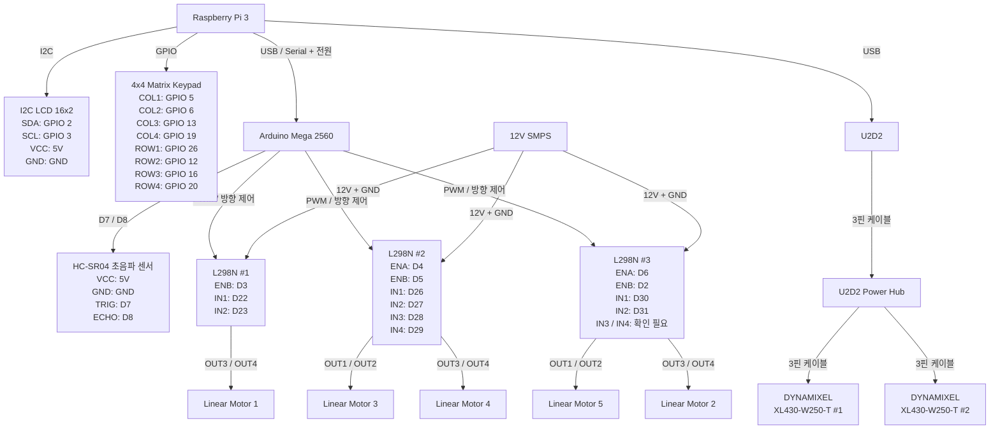

# 스마트 시트 전체 결선도

---

## 주요 연결 요약

| 제어 장치 | 연결 대상 | 연결 방식 |
|---|---|---|
| Raspberry Pi 3 | Arduino Mega 2560 | USB |
| Raspberry Pi 3 | I2C LCD | GPIO 2 / GPIO 3 |
| Raspberry Pi 3 | 4×4 Matrix Keypad | GPIO |
| Raspberry Pi 3 | U2D2 | USB |
| Arduino Mega | HC-SR04 | D7 / D8 |
| Arduino Mega | L298N #1 | PWM + 방향 제어 |
| Arduino Mega | L298N #2 | PWM + 방향 제어 |
| Arduino Mega | L298N #3 | PWM + 방향 제어 |
| L298N #1 | Linear Motor 1 | OUT3 / OUT4 |
| L298N #2 | Linear Motor 3 | OUT1 / OUT2 |
| L298N #2 | Linear Motor 4 | OUT3 / OUT4 |
| L298N #3 | Linear Motor 2 | OUT3 / OUT4 |
| L298N #3 | Linear Motor 5 | OUT1 / OUT2 |
| U2D2 | U2D2 Power Hub | 3핀 케이블 |
| U2D2 Power Hub | DYNAMIXEL #1 | 3핀 케이블 |
| U2D2 Power Hub | DYNAMIXEL #2 | 3핀 케이블 |
| 12V SMPS | L298N #1 / #2 / #3 | 12V + GND |
