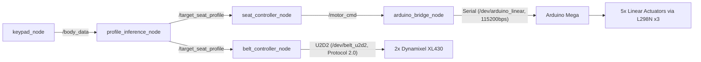

# ROS 2 Architecture

Smart Seat (Family Care)의 ROS 2 노드 구성, 토픽 흐름, 메시지 정의, 설계 결정을 정리한 문서입니다.

---

## 1. 노드 구성 개요

총 5개 노드가 하나의 launch 파일(`smart_seat.launch.py`)로 동시 실행됩니다.

| 노드 | 파일 | 역할 |
|---|---|---|
| `keypad_node` | `keypad_node.py` | 4x4 키패드 스캔, I2C LCD 출력, 가족 프로필 관리, 초음파 자동측정 |
| `profile_inference_node` | `profile_inference_node.py` | Size Korea 회귀식 + 가우시안 곡선 계산, 벨트 목표 산출 |
| `seat_controller_node` | `seat_controller_node.py` | 리니어 액추에이터 5개 시간기반 구동 |
| `belt_controller_node` | `belt_controller_node.py` | 다이나믹셀 2개 포지션 제어 |
| `arduino_bridge_node` | `arduino_bridge_node.py` | ROS 2 ↔ 아두이노 시리얼 브릿지 |

---

## 2. 시스템 아키텍처 다이어그램



---

## 3. 토픽 / 메시지 정리

| 토픽 | 메시지 타입 | 발행 | 구독 | 설명 |
|---|---|---|---|---|
| `/body_data` | `geometry_msgs/Point` | `keypad_node` | `profile_inference_node` | x=키(cm), y=몸무게(kg, 고정 65), z=임산부여부(0/1) |
| `/target_seat_profile` | `smart_seat/TargetSeatProfile` (커스텀) | `profile_inference_node` | `seat_controller_node`, `belt_controller_node` | 등받이 목표(actuator_mm[]) + 벨트 목표(belt_height_cm, 실제로는 필요틱수) |
| `/motor_cmd` | `std_msgs/String` | `seat_controller_node` | `arduino_bridge_node` | `M,모터번호,방향,속도` 형식 문자열 |

### `TargetSeatProfile.msg`

```
float32 belt_height_cm     # 벨트 필요 틱수 (필드명은 유지, 실제 단위는 틱)
float32[] actuator_mm      # 액추에이터 5개 목표 밀기량(mm)
```

- 리셋 신호는 `actuator_mm`의 모든 값이 0 이하일 때로 판단 (`belt_controller_node`는 이 신호를 무시하고 `seat_controller_node`만 반응)

---

## 4. 노드별 상세

### `keypad_node`
- 4x4 매트릭스 키패드(GPIO 폴링, 50ms 주기), I2C LCD(0x27)
- `profiles.json`에서 가족 프로필(A/B/C: 이름·키·임산부여부) 로드
- A/B/C: 저장된 프로필 즉시 적용
- D 짧게: 게스트 모드(숫자 직접입력)
- D 3초 롱프레스: 초음파 자동측정 모드
- `.`: 평상시 리셋 / 게스트모드 중 입력 없을 때 리셋+탈출 / 입력 중일 때 소수점
- 소프트웨어 안전장치: 4연속 디바운스, 다중 키 동시감지 시 무시(유령신호 방지), 부팅 1.5초 워밍업 무시구간, 게스트모드 오진입 시 프로필키 입력으로 자동 복구

### `profile_inference_node`
- Size Korea 8차 회귀식으로 앉은키 추정
- 가우시안 곡선으로 5개 액추에이터 각각의 밀기량 계산 (요추 곡선 + 헤드서포트, 둘 중 큰 값 채택)
- 벨트 목표(어깨/골반) 계산 후 2:1 스케일 + 실측 보정 적용, 틱수로 변환

### `seat_controller_node`
- 위치 센서 없음 → 모터별/방향별 실측 속도로 구동 시간 역산
- `MOTOR_MAP`으로 물리적으로 뒤바뀐 1·2번 액추에이터를 소프트웨어에서 보정
- 리셋 시 가장 오래 걸리는 모터 기준 + 여유시간만큼 전체 후진, 2번 모터만 추가 후진

### `belt_controller_node`
- Extended Position Control Mode(다회전)로 다이나믹셀 2개 구동
- `belt_home.json`에서 홈 포지션 로드, 노드 시작 시 1회 자동 홈 복귀
- 목표 도착까지 대기(포지션 스톨 감지) — 고정 타임아웃 방식은 재현성 문제로 폐기됨
- `threading.Lock`으로 동시 명령 충돌 방지 (연타 시 Race Condition 해결)
- 리셋 신호 무시 (벨트 리셋은 느려서 매번 반응하지 않음)

### `arduino_bridge_node`
- `/motor_cmd` 구독, `M,모터,방향,속도` 프로토콜로 변환하여 시리얼 전송

---

## 5. 설계 결정 근거

- **커스텀 메시지(`TargetSeatProfile`) 사용 이유**: 등받이(연속값 배열)와 벨트(단일값)를 한 번에 묶어 전달, 두 컨트롤러 노드가 같은 발행 시점의 목표를 일관되게 받도록 함
- **리셋 신호를 별도 토픽이 아닌 `/target_seat_profile`의 특수값(0 이하)으로 처리**: 새 토픽/서비스를 추가하지 않고 기존 파이프라인 재사용
- **벨트와 등받이 리셋 정책을 분리**: 벨트 홈 복귀가 상대적으로 느려, 매 리셋마다 실행하면 사용성이 떨어짐 — 노드 시작 시 1회만 자동 수행
- **USB 장치 이름 고정(`/dev/arduino_linear`, `/dev/belt_u2d2`)**: `udev` 규칙으로 포트 번호 유동성 문제 해결, 코드에서 하드코딩된 경로 안정성 확보
