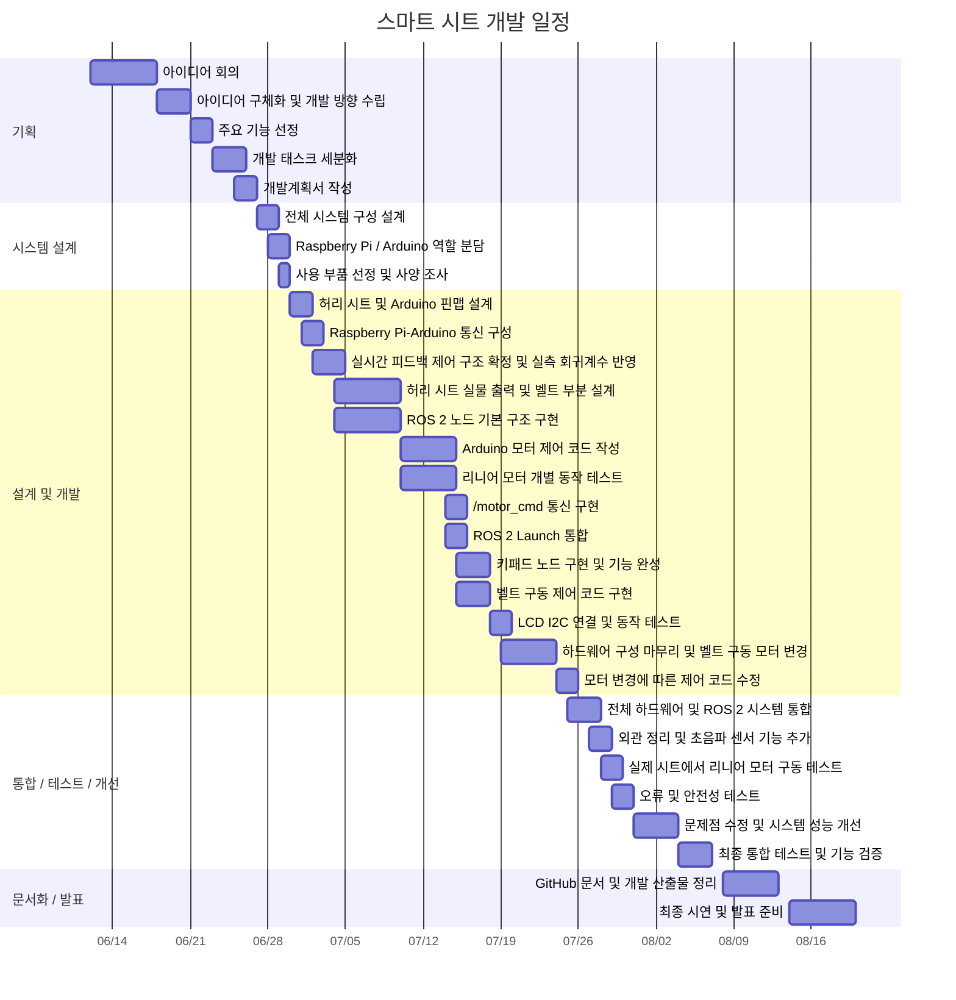

```mermaid
gantt
    title 스마트 시트 개발 일정
    dateFormat YYYY-MM-DD
    axisFormat %m/%d
    todayMarker off

    section 기획
    아이디어 회의 : 2026-06-12, 6d
    아이디어 구체화 및 개발 방향 수립 : 2026-06-18, 3d
    주요 기능 선정 : 2026-06-21, 2d
    개발 태스크 세분화 : 2026-06-23, 3d
    개발계획서 작성 : 2026-06-25, 2d

    section 시스템 설계
    전체 시스템 구성 설계 : 2026-06-27, 2d
    Raspberry Pi / Arduino 역할 분담 : 2026-06-28, 2d
    사용 부품 선정 및 사양 조사 : 2026-06-29, 1d

    section 설계 및 개발
    허리 시트 및 Arduino 핀맵 설계 : 2026-06-30, 2d
    Raspberry Pi-Arduino 통신 구성 : 2026-07-01, 2d
    실시간 피드백 제어 구조 확정 및 실측 회귀계수 반영 : 2026-07-02, 3d
    허리 시트 실물 출력 및 벨트 부분 설계 : 2026-07-04, 6d
    ROS 2 노드 기본 구조 구현 : 2026-07-04, 6d
    Arduino 모터 제어 코드 작성 : 2026-07-10, 5d
    리니어 모터 개별 동작 테스트 : 2026-07-10, 5d
    /motor_cmd 통신 구현 : 2026-07-14, 2d
    ROS 2 Launch 통합 : 2026-07-14, 2d
    키패드 노드 구현 및 기능 완성 : 2026-07-15, 3d
    벨트 구동 제어 코드 구현 : 2026-07-15, 3d
    LCD I2C 연결 및 동작 테스트 : 2026-07-18, 2d
    하드웨어 구성 마무리 및 벨트 구동 모터 변경 : 2026-07-19, 5d
    모터 변경에 따른 제어 코드 수정 : 2026-07-24, 2d

    section 통합 / 테스트 / 개선
    전체 하드웨어 및 ROS 2 시스템 통합 : 2026-07-25, 3d
    외관 정리 및 초음파 센서 기능 추가 : 2026-07-27, 2d
    실제 시트에서 리니어 모터 구동 테스트 : 2026-07-28, 2d
    오류 및 안전성 테스트 : 2026-07-29, 2d
    문제점 수정 및 시스템 성능 개선 : 2026-07-31, 4d
    최종 통합 테스트 및 기능 검증 : 2026-08-04, 3d

    section 문서화 / 발표
    GitHub 문서 및 개발 산출물 정리 : 2026-08-08, 5d
    최종 시연 및 발표 준비 : 2026-08-14, 6d
```
